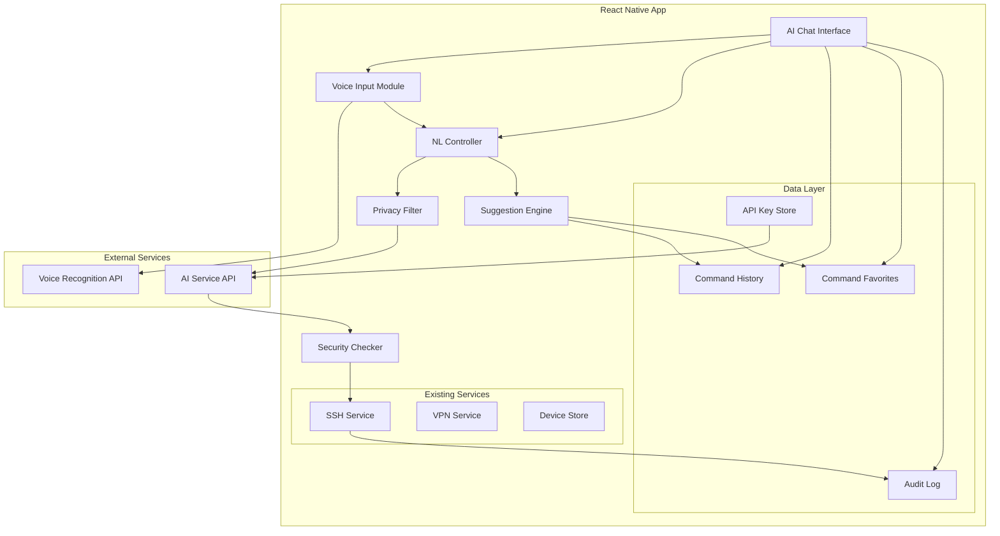

# 设计文档 - 影梭第二阶段：自然语言智能控制

## 概述

本设计文档描述影梭第二阶段的自然语言智能控制功能的技术实现。该阶段在第一阶段（VPN 连接、设备发现、SSH 终端）的基础上，增加了 AI 驱动的自然语言命令解析、语音输入、隐私保护、智能建议等功能。

### 核心功能模块

1. **自然语言处理模块**: 使用 AI 服务（OpenAI GPT-4 / Claude）解析自然语言并生成 Shell 命令
2. **语音输入模块**: 语音识别和转文字功能
3. **隐私保护模块**: 敏感信息脱敏和还原
4. **安全控制模块**: 危险命令检测和二次确认
5. **智能建议模块**: 基于历史和上下文的命令建议
6. **数据管理模块**: 命令历史、收藏和审计日志
7. **AI 对话界面**: 聊天式交互界面
8. **离线模式**: 无网络时的降级功能

### 技术栈

- **前端框架**: React Native 0.73+ (TypeScript)
- **AI 服务**: OpenAI GPT-4 / Claude 3.5 Sonnet
- **语音识别**: Expo Speech / React Native Voice
- **本地存储**: MMKV (高性能键值存储)
- **状态管理**: Zustand
- **加密**: Expo SecureStore (API 密钥加密存储)
- **属性测试**: fast-check

## 架构

### 系统架构图



### 数据流

1. **自然语言命令执行流程**:
   ```
   用户输入 → 隐私过滤 → AI 解析 → 安全检查 → 用户确认 → SSH 执行 → 结果展示 → 历史记录 → 审计日志
   ```

2. **语音输入流程**:
   ```
   按住录音 → 语音识别 → 文本显示 → 自然语言处理流程
   ```

3. **智能建议流程**:
   ```
   用户输入 → 查询历史 → 上下文匹配 → 排序 → 显示建议
   ```

## 组件和接口

### 1. NL Controller (自然语言控制器)

负责协调自然语言解析的整个流程。

```typescript
interface NLController {
  /**
   * 解析自然语言并返回命令
   * @param input 用户输入的自然语言
   * @param context 上下文信息（当前目录、设备信息等）
   * @returns 解析结果
   */
  parseNaturalLanguage(
    input: string,
    context: CommandContext
  ): Promise<ParseResult>;

  /**
   * 执行命令
   * @param command 要执行的命令
   * @param deviceId 目标设备 ID
   * @returns 执行结果
   */
  executeCommand(
    command: string,
    deviceId: string
  ): Promise<ExecutionResult>;

  /**
   * 取消正在进行的解析请求
   */
  cancelParsing(): void;
}

interface CommandContext {
  currentDirectory: string;
  deviceInfo: DeviceInfo;
  recentCommands: string[];
  conversationHistory: Message[];
}

interface ParseResult {
  success: boolean;
  command?: string;
  explanation?: string;
  confidence: number;
  isDangerous: boolean;
  error?: string;
}

interface ExecutionResult {
  success: boolean;
  output: string;
  exitCode: number;
  executionTime: number;
  error?: string;
}
```

### 2. AI Service (AI 服务接口)

抽象的 AI 服务接口，支持多个提供商。

```typescript
interface AIService {
  /**
   * 发送请求到 AI 服务
   * @param prompt 提示词
   * @param options 请求选项
   * @returns AI 响应
   */
  sendRequest(
    prompt: string,
    options: AIRequestOptions
  ): Promise<AIResponse>;

  /**
   * 验证 API 密钥
   * @param apiKey API 密钥
   * @returns 是否有效
   */
  validateAPIKey(apiKey: string): Promise<boolean>;

  /**
   * 获取服务状态
   * @returns 服务是否可用
   */
  getServiceStatus(): Promise<ServiceStatus>;
}

interface AIRequestOptions {
  maxTokens?: number;
  temperature?: number;
  timeout?: number;
  conversationHistory?: Message[];
}

interface AIResponse {
  command: string;
  explanation: string;
  confidence: number;
  rawResponse: string;
}

interface ServiceStatus {
  available: boolean;
  latency?: number;
  error?: string;
}

// 具体实现
class OpenAIService implements AIService { }
class ClaudeService implements AIService { }
```

### 3. Privacy Filter (隐私过滤器)

在发送到 AI 前脱敏敏感信息。

```typescript
interface PrivacyFilter {
  /**
   * 脱敏文本中的敏感信息
   * @param text 原始文本
   * @returns 脱敏后的文本和映射关系
   */
  sanitize(text: string): SanitizedText;

  /**
   * 还原脱敏的文本
   * @param text 脱敏后的文本
   * @param mapping 映射关系
   * @returns 还原后的文本
   */
  restore(text: string, mapping: SensitiveMapping): string;

  /**
   * 检测文本中的敏感信息类型
   * @param text 文本
   * @returns 敏感信息列表
   */
  detectSensitiveInfo(text: string): SensitiveInfo[];
}

interface SanitizedText {
  sanitized: string;
  mapping: SensitiveMapping;
  detectedTypes: SensitiveType[];
}

interface SensitiveMapping {
  [placeholder: string]: string;
}

type SensitiveType = 'file_path' | 'ip_address' | 'password' | 'api_key' | 'email';

interface SensitiveInfo {
  type: SensitiveType;
  value: string;
  startIndex: number;
  endIndex: number;
}
```

### 4. Security Checker (安全检查器)

检测危险命令并要求确认。

```typescript
interface SecurityChecker {
  /**
   * 检查命令是否危险
   * @param command 命令字符串
   * @returns 检查结果
   */
  checkCommand(command: string): SecurityCheckResult;

  /**
   * 获取危险命令模式列表
   * @returns 危险模式列表
   */
  getDangerousPatterns(): DangerousPattern[];

  /**
   * 添加自定义危险模式
   * @param pattern 危险模式
   */
  addDangerousPattern(pattern: DangerousPattern): void;

  /**
   * 移除危险模式
   * @param patternId 模式 ID
   */
  removeDangerousPattern(patternId: string): void;
}

interface SecurityCheckResult {
  isDangerous: boolean;
  riskLevel: 'low' | 'medium' | 'high' | 'critical';
  matchedPatterns: DangerousPattern[];
  warnings: string[];
  requiresConfirmation: boolean;
}

interface DangerousPattern {
  id: string;
  pattern: RegExp;
  description: string;
  riskLevel: 'low' | 'medium' | 'high' | 'critical';
  examples: string[];
}
```

### 5. Voice Input Module (语音输入模块)

处理语音录制和识别。

```typescript
interface VoiceInputModule {
  /**
   * 开始录音
   * @returns 录音会话 ID
   */
  startRecording(): Promise<string>;

  /**
   * 停止录音并识别
   * @param sessionId 录音会话 ID
   * @returns 识别结果
   */
  stopRecording(sessionId: string): Promise<VoiceRecognitionResult>;

  /**
   * 取消录音
   * @param sessionId 录音会话 ID
   */
  cancelRecording(sessionId: string): void;

  /**
   * 检查麦克风权限
   * @returns 是否有权限
   */
  checkPermission(): Promise<boolean>;

  /**
   * 请求麦克风权限
   * @returns 是否授权
   */
  requestPermission(): Promise<boolean>;

  /**
   * 获取录音状态
   * @param sessionId 录音会话 ID
   * @returns 录音状态
   */
  getRecordingStatus(sessionId: string): RecordingStatus;
}

interface VoiceRecognitionResult {
  success: boolean;
  text?: string;
  confidence: number;
  language: 'zh' | 'en';
  duration: number;
  error?: string;
}

interface RecordingStatus {
  isRecording: boolean;
  duration: number;
  audioLevel: number;
}
```

### 6. Suggestion Engine (命令建议引擎)

基于历史和上下文提供智能建议。

```typescript
interface SuggestionEngine {
  /**
   * 获取命令建议
   * @param input 用户输入
   * @param context 上下文
   * @returns 建议列表
   */
  getSuggestions(
    input: string,
    context: CommandContext
  ): Promise<Suggestion[]>;

  /**
   * 记录命令使用
   * @param command 命令
   * @param context 上下文
   */
  recordCommandUsage(command: string, context: CommandContext): void;

  /**
   * 清除建议缓存
   */
  clearCache(): void;
}

interface Suggestion {
  command: string;
  description: string;
  score: number;
  source: 'history' | 'favorite' | 'context';
  lastUsed?: Date;
  usageCount: number;
}
```

### 7. Command History Store (命令历史存储)

管理命令历史记录。

```typescript
interface CommandHistoryStore {
  /**
   * 添加历史记录
   * @param entry 历史条目
   */
  addEntry(entry: HistoryEntry): Promise<void>;

  /**
   * 获取历史记录
   * @param filter 过滤条件
   * @param limit 最大数量
   * @returns 历史记录列表
   */
  getHistory(filter?: HistoryFilter, limit?: number): Promise<HistoryEntry[]>;

  /**
   * 删除历史记录
   * @param entryId 条目 ID
   */
  deleteEntry(entryId: string): Promise<void>;

  /**
   * 清空历史记录
   */
  clearHistory(): Promise<void>;

  /**
   * 搜索历史记录
   * @param query 搜索关键词
   * @returns 匹配的历史记录
   */
  searchHistory(query: string): Promise<HistoryEntry[]>;
}

interface HistoryEntry {
  id: string;
  timestamp: Date;
  deviceId: string;
  deviceName: string;
  userInput: string;
  parsedCommand: string;
  output: string;
  exitCode: number;
  executionTime: number;
  isDangerous: boolean;
}

interface HistoryFilter {
  deviceId?: string;
  startDate?: Date;
  endDate?: Date;
  isDangerous?: boolean;
}
```

### 8. Command Favorite Store (命令收藏存储)

管理收藏的命令。

```typescript
interface CommandFavoriteStore {
  /**
   * 添加收藏
   * @param favorite 收藏条目
   */
  addFavorite(favorite: FavoriteEntry): Promise<void>;

  /**
   * 获取所有收藏
   * @returns 收藏列表
   */
  getFavorites(): Promise<FavoriteEntry[]>;

  /**
   * 更新收藏
   * @param favoriteId 收藏 ID
   * @param updates 更新内容
   */
  updateFavorite(
    favoriteId: string,
    updates: Partial<FavoriteEntry>
  ): Promise<void>;

  /**
   * 删除收藏
   * @param favoriteId 收藏 ID
   */
  deleteFavorite(favoriteId: string): Promise<void>;

  /**
   * 搜索收藏
   * @param query 搜索关键词
   * @returns 匹配的收藏
   */
  searchFavorites(query: string): Promise<FavoriteEntry[]>;
}

interface FavoriteEntry {
  id: string;
  name: string;
  description: string;
  command: string;
  createdAt: Date;
  updatedAt: Date;
  usageCount: number;
  tags: string[];
}
```

### 9. Audit Log Store (审计日志存储)

记录所有命令执行的审计日志。

```typescript
interface AuditLogStore {
  /**
   * 添加审计日志
   * @param log 日志条目
   */
  addLog(log: AuditLogEntry): Promise<void>;

  /**
   * 获取审计日志
   * @param filter 过滤条件
   * @param limit 最大数量
   * @returns 日志列表
   */
  getLogs(filter?: AuditLogFilter, limit?: number): Promise<AuditLogEntry[]>;

  /**
   * 导出日志
   * @param format 导出格式
   * @param filter 过滤条件
   * @returns 导出的文件路径
   */
  exportLogs(
    format: 'json' | 'csv',
    filter?: AuditLogFilter
  ): Promise<string>;

  /**
   * 清理过期日志
   * @param daysToKeep 保留天数
   */
  cleanupOldLogs(daysToKeep: number): Promise<number>;
}

interface AuditLogEntry {
  id: string;
  timestamp: Date;
  deviceId: string;
  userInput: string;
  aiParsedCommand: string;
  executedCommand: string;
  output: string;
  exitCode: number;
  riskLevel: 'low' | 'medium' | 'high' | 'critical';
  wasConfirmed: boolean;
  executionTime: number;
}

interface AuditLogFilter {
  deviceId?: string;
  startDate?: Date;
  endDate?: Date;
  riskLevel?: 'low' | 'medium' | 'high' | 'critical';
}
```

### 10. API Key Store (API 密钥存储)

安全存储和管理 AI 服务的 API 密钥。

```typescript
interface APIKeyStore {
  /**
   * 保存 API 密钥
   * @param provider 服务提供商
   * @param apiKey API 密钥
   */
  saveAPIKey(provider: AIProvider, apiKey: string): Promise<void>;

  /**
   * 获取 API 密钥
   * @param provider 服务提供商
   * @returns API 密钥
   */
  getAPIKey(provider: AIProvider): Promise<string | null>;

  /**
   * 删除 API 密钥
   * @param provider 服务提供商
   */
  deleteAPIKey(provider: AIProvider): Promise<void>;

  /**
   * 获取已配置的提供商列表
   * @returns 提供商列表
   */
  getConfiguredProviders(): Promise<AIProvider[]>;

  /**
   * 获取掩码后的密钥（用于显示）
   * @param provider 服务提供商
   * @returns 掩码后的密钥
   */
  getMaskedAPIKey(provider: AIProvider): Promise<string | null>;
}

type AIProvider = 'openai' | 'claude' | 'gemini';
```

## 数据模型

### 1. Message (对话消息)

```typescript
interface Message {
  id: string;
  role: 'user' | 'assistant' | 'system';
  content: string;
  timestamp: Date;
  metadata?: MessageMetadata;
}

interface MessageMetadata {
  command?: string;
  executionResult?: ExecutionResult;
  isConfirmed?: boolean;
  isDangerous?: boolean;
}
```

### 2. Conversation (对话会话)

```typescript
interface Conversation {
  id: string;
  deviceId: string;
  messages: Message[];
  createdAt: Date;
  updatedAt: Date;
  context: CommandContext;
}
```

### 3. Settings (应用设置)

```typescript
interface AppSettings {
  // AI 设置
  aiProvider: AIProvider;
  aiTimeout: number;
  aiMaxTokens: number;
  
  // 隐私设置
  privacyFilterEnabled: boolean;
  
  // 安全设置
  dangerousCommandWarning: boolean;
  requireConfirmation: boolean;
  customDangerousPatterns: DangerousPattern[];
  
  // 语音设置
  voiceInputEnabled: boolean;
  voiceLanguage: 'zh' | 'en' | 'auto';
  
  // 界面设置
  language: 'zh' | 'en';
  theme: 'light' | 'dark' | 'auto';
  
  // 历史设置
  maxHistoryEntries: number;
  historyRetentionDays: number;
  
  // 审计设置
  auditLogEnabled: boolean;
  auditLogRetentionDays: number;
  
  // 离线模式
  offlineMode: boolean;
}
```

### 4. Device Info (设备信息)

```typescript
interface DeviceInfo {
  id: string;
  name: string;
  os: 'linux' | 'macos' | 'windows';
  shell: 'bash' | 'zsh' | 'sh' | 'powershell';
  currentDirectory: string;
  username: string;
  hostname: string;
}
```

### 5. Storage Schema (存储结构)

使用 MMKV 存储的键值结构：

```typescript
// 存储键定义
const StorageKeys = {
  // API 密钥（使用 SecureStore）
  API_KEY_PREFIX: 'api_key_',
  
  // 命令历史
  COMMAND_HISTORY: 'command_history',
  
  // 命令收藏
  COMMAND_FAVORITES: 'command_favorites',
  
  // 审计日志
  AUDIT_LOGS: 'audit_logs',
  
  // 应用设置
  APP_SETTINGS: 'app_settings',
  
  // 对话历史
  CONVERSATIONS: 'conversations',
  
  // 危险命令模式
  DANGEROUS_PATTERNS: 'dangerous_patterns',
} as const;
```

## 正确性属性

*属性是一个特征或行为，应该在系统的所有有效执行中保持为真——本质上是关于系统应该做什么的形式化陈述。属性作为人类可读规范和机器可验证正确性保证之间的桥梁。*

### 验收标准测试性分析

基于需求文档中的验收标准，以下是可测试性分析：

**需求 1: 自然语言命令解析**
- 1.1 调用 AI 服务解析: 可测试 - 属性
- 1.2 展示命令并请求确认: 可测试 - 属性
- 1.3 确认后执行命令: 可测试 - 属性
- 1.4 解析失败提示: 可测试 - 属性
- 1.5 支持中英文: 可测试 - 属性
- 1.6 超时提示: 可测试 - 属性
- 1.7 显示执行结果: 可测试 - 属性

**需求 2: 语音输入控制**
- 2.1 按住开始录音: 可测试 - 属性
- 2.2 松开停止录音: 可测试 - 属性
- 2.3 显示识别文本: 可测试 - 属性
- 2.4 识别失败提示: 可测试 - 属性
- 2.5 1秒内完成识别: 可测试 - 属性
- 2.6 支持中英文识别: 可测试 - 属性
- 2.7 噪音提示: 可测试 - 边缘情况

**需求 3: 隐私保护**
- 3.1 文件路径脱敏: 可测试 - 属性（往返属性）
- 3.2 IP 地址脱敏: 可测试 - 属性（往返属性）
- 3.3 密码脱敏: 可测试 - 属性（往返属性）
- 3.4 占位符还原: 可测试 - 属性（往返属性）
- 3.5 本地记录映射: 可测试 - 属性
- 3.6 隐私过滤开关: 可测试 - 示例
- 3.7 关闭时警告: 可测试 - 示例

**需求 4: 危险命令检测**
- 4.1 检测 rm -rf: 可测试 - 属性
- 4.2 检测 dd/mkfs/fdisk: 可测试 - 属性
- 4.3 二次确认: 可测试 - 属性
- 4.4 取消不执行: 可测试 - 属性
- 4.5 审计日志记录: 可测试 - 属性
- 4.6 自定义危险列表: 可测试 - 属性
- 4.7 sudo 权限警告: 可测试 - 属性

**需求 5: 智能命令建议**
- 5.1 实时显示建议: 可测试 - 属性
- 5.2 选择自动填充: 可测试 - 属性
- 5.3 目录相关建议: 可测试 - 属性
- 5.4 最近命令优先: 可测试 - 属性
- 5.5 500ms 内返回: 可测试 - 属性
- 5.6 最多5条建议: 可测试 - 属性
- 5.7 无匹配不显示: 可测试 - 属性

**需求 6: 命令历史管理**
- 6.1 保存命令信息: 可测试 - 属性
- 6.2 倒序显示: 可测试 - 属性
- 6.3 显示详情: 可测试 - 属性
- 6.4 重新执行: 可测试 - 属性
- 6.5 筛选功能: 可测试 - 属性
- 6.6 最多1000条: 可测试 - 属性
- 6.7 自动删除最旧: 可测试 - 属性

**需求 7: 命令收藏功能**
- 7.1 长按显示收藏: 可测试 - 属性
- 7.2 输入名称描述: 可测试 - 属性
- 7.3 显示所有收藏: 可测试 - 属性
- 7.4 点击填充: 可测试 - 属性
- 7.5 编辑收藏: 可测试 - 属性
- 7.6 删除收藏: 可测试 - 属性
- 7.7 搜索收藏: 可测试 - 属性

**需求 8: AI 对话界面**
- 8.1 显示聊天布局: 不可测试 - UI 布局
- 8.2 显示用户消息: 可测试 - 属性
- 8.3 显示思考动画: 不可测试 - UI 动画
- 8.4 显示 AI 消息: 可测试 - 属性
- 8.5 显示执行结果: 可测试 - 属性
- 8.6 保持对话历史: 可测试 - 属性
- 8.7 清除对话: 可测试 - 属性

**需求 9: 离线模式**
- 9.1 自动切换离线: 可测试 - 属性
- 9.2 禁用解析功能: 可测试 - 属性
- 9.3 访问历史收藏: 可测试 - 属性
- 9.4 直接执行命令: 可测试 - 属性
- 9.5 自动切换在线: 可测试 - 属性
- 9.6 显示模式状态: 可测试 - 属性
- 9.7 手动切换: 可测试 - 属性

**需求 10: API 密钥管理**
- 10.1 首次提示输入: 可测试 - 示例
- 10.2 加密存储: 可测试 - 属性
- 10.3 显示部分字符: 可测试 - 属性
- 10.4 验证新密钥: 可测试 - 属性
- 10.5 支持多提供商: 可测试 - 属性
- 10.6 密钥问题提示: 可测试 - 属性
- 10.7 删除密钥: 可测试 - 属性

**需求 11: 审计日志**
- 11.1 记录完整信息: 可测试 - 属性
- 11.2 标记高风险: 可测试 - 属性
- 11.3 显示所有日志: 可测试 - 属性
- 11.4 筛选功能: 可测试 - 属性
- 11.5 导出功能: 可测试 - 属性
- 11.6 最多30天: 可测试 - 属性
- 11.7 自动删除过期: 可测试 - 属性

**需求 12: 性能要求**
- 12.1-12.7: 性能测试 - 不适合单元测试

**需求 13: 多语言支持**
- 13.1 支持切换: 可测试 - 属性
- 13.2 立即更新: 可测试 - 属性
- 13.3 自动检测语言: 可测试 - 属性
- 13.4 语音引擎选择: 可测试 - 属性
- 13.5 语言选择选项: 可测试 - 示例
- 13.6 保存偏好: 可测试 - 属性
- 13.7 中文提示: 可测试 - 属性

**需求 14: 错误处理**
- 14.1 显示错误原因: 可测试 - 属性
- 14.2 显示退出码: 可测试 - 属性
- 14.3 语音失败提示: 可测试 - 属性
- 14.4 脱敏预览: 可测试 - 属性
- 14.5 解决建议: 可测试 - 属性
- 14.6 重试取消选项: 可测试 - 属性
- 14.7 记录错误事件: 可测试 - 属性

### 属性反思

在编写具体属性之前，需要识别和消除冗余：

1. **隐私过滤属性合并**: 3.1-3.4 都是关于脱敏和还原的往返属性，可以合并为一个综合的往返属性
2. **危险命令检测合并**: 4.1-4.2 可以合并为一个检测危险模式的属性
3. **历史管理属性**: 6.6-6.7 关于容量限制的属性可以合并
4. **审计日志属性**: 11.6-11.7 关于日志保留的属性可以合并
5. **语言支持属性**: 13.2 和 13.7 可以合并为语言切换的综合属性

### 核心正确性属性

#### 属性 1: 隐私过滤往返一致性
*对于任何*包含敏感信息的文本，经过脱敏处理后再还原，应该得到与原始文本等价的结果。

**验证需求**: 3.1, 3.2, 3.3, 3.4

#### 属性 2: 危险命令检测完整性
*对于任何*命令字符串，如果它匹配已知的危险模式列表中的任何模式，则安全检查器必须将其标记为危险命令。

**验证需求**: 4.1, 4.2, 4.6

#### 属性 3: 命令历史容量限制
*对于任何*命令历史存储，当添加新条目导致总数超过最大限制时，最旧的条目应该被自动删除，使总数保持在限制内。

**验证需求**: 6.6, 6.7

#### 属性 4: 审计日志保留策略
*对于任何*审计日志存储，清理操作应该删除所有超过保留天数的日志条目，并保留所有未超期的条目。

**验证需求**: 11.6, 11.7

#### 属性 5: 命令建议数量限制
*对于任何*命令建议请求，返回的建议列表长度不应超过配置的最大数量（默认5条）。

**验证需求**: 5.6

#### 属性 6: 命令建议排序正确性
*对于任何*命令建议列表，如果包含最近使用的命令，这些命令应该排在列表前面（按使用时间倒序）。

**验证需求**: 5.4

#### 属性 7: 历史记录时间排序
*对于任何*历史记录查询，返回的记录应该按时间戳倒序排列（最新的在前）。

**验证需求**: 6.2

#### 属性 8: 收藏命令唯一性
*对于任何*收藏操作，如果命令已经存在于收藏列表中，系统应该拒绝重复添加或更新现有收藏。

**验证需求**: 7.2

#### 属性 9: API 密钥掩码显示
*对于任何*存储的 API 密钥，在显示时应该只显示前缀和后缀（如 `sk-...xyz`），中间部分应该被掩码。

**验证需求**: 10.3

#### 属性 10: 离线模式功能降级
*对于任何*离线模式状态，自然语言解析功能应该被禁用，但历史记录和收藏功能应该保持可用。

**验证需求**: 9.2, 9.3

#### 属性 11: 对话历史上下文保持
*对于任何*对话会话，新消息应该被追加到现有消息列表中，保持时间顺序和完整的对话上下文。

**验证需求**: 8.6

#### 属性 12: 语言切换一致性
*对于任何*语言切换操作，所有界面文本、错误消息和提示应该立即更新为选定的语言。

**验证需求**: 13.2, 13.7

#### 属性 13: 命令执行审计完整性
*对于任何*执行的命令，审计日志中应该包含完整的执行信息（时间戳、输入、命令、输出、退出码、风险级别）。

**验证需求**: 11.1, 11.2

#### 属性 14: 危险命令二次确认
*对于任何*被标记为危险的命令，在用户明确确认之前，系统不应该执行该命令。

**验证需求**: 4.3, 4.4

#### 属性 15: 历史记录筛选正确性
*对于任何*历史记录筛选条件（设备、时间范围、危险标记），返回的记录应该全部满足所有指定的筛选条件。

**验证需求**: 6.5

#### 属性 16: 收藏搜索匹配性
*对于任何*收藏搜索查询，返回的收藏条目的名称、描述或命令内容应该包含搜索关键词。

**验证需求**: 7.7

#### 属性 17: AI 服务超时处理
*对于任何*AI 服务请求，如果响应时间超过配置的超时时间，系统应该取消请求并显示超时提示。

**验证需求**: 1.6

#### 属性 18: 命令确认前展示
*对于任何*AI 解析成功的命令，在执行前必须向用户展示命令内容并等待确认。

**验证需求**: 1.2

#### 属性 19: 语音识别结果显示
*对于任何*成功的语音识别，识别的文本应该被显示在输入框中，供用户确认或修改。

**验证需求**: 2.3

#### 属性 20: 错误信息完整性
*对于任何*命令执行失败，系统应该显示退出状态码和错误输出，帮助用户理解失败原因。

**验证需求**: 14.2


## 错误处理

### 错误分类

系统中的错误分为以下几类：

1. **网络错误**: AI 服务不可达、超时、连接失败
2. **认证错误**: API 密钥无效、配额超限、权限不足
3. **解析错误**: AI 无法理解输入、返回格式错误
4. **执行错误**: SSH 连接失败、命令执行失败、权限不足
5. **存储错误**: 本地存储失败、数据损坏
6. **权限错误**: 麦克风权限未授予、安全存储访问失败
7. **验证错误**: 输入验证失败、数据格式错误

### 错误处理策略

#### 1. 网络错误处理

```typescript
class NetworkErrorHandler {
  handleAIServiceError(error: Error): ErrorResponse {
    if (error.message.includes('timeout')) {
      return {
        type: 'timeout',
        message: '连接超时，请检查网络连接',
        action: 'retry',
        canRetry: true,
      };
    }
    
    if (error.message.includes('network')) {
      return {
        type: 'network',
        message: '网络连接失败，已切换到离线模式',
        action: 'offline_mode',
        canRetry: true,
      };
    }
    
    return {
      type: 'unknown',
      message: '未知网络错误',
      action: 'contact_support',
      canRetry: false,
    };
  }
}
```

#### 2. 认证错误处理

```typescript
class AuthErrorHandler {
  handleAPIKeyError(error: Error): ErrorResponse {
    if (error.message.includes('invalid_api_key')) {
      return {
        type: 'invalid_key',
        message: 'API 密钥无效，请检查并重新输入',
        action: 'update_key',
        canRetry: false,
      };
    }
    
    if (error.message.includes('quota_exceeded')) {
      return {
        type: 'quota_exceeded',
        message: 'API 配额已用完，请升级账户或稍后再试',
        action: 'upgrade_or_wait',
        canRetry: true,
      };
    }
    
    return {
      type: 'auth_error',
      message: '认证失败',
      action: 'check_credentials',
      canRetry: false,
    };
  }
}
```

#### 3. 解析错误处理

```typescript
class ParsingErrorHandler {
  handleParsingError(error: Error, userInput: string): ErrorResponse {
    return {
      type: 'parsing_error',
      message: 'AI 无法理解您的输入，请尝试更详细的描述',
      action: 'rephrase',
      canRetry: true,
      suggestions: [
        '尝试使用更具体的动词（如"列出"、"删除"、"创建"）',
        '提供更多上下文信息',
        '使用简单的句子结构',
      ],
    };
  }
}
```

#### 4. 执行错误处理

```typescript
class ExecutionErrorHandler {
  handleCommandError(
    exitCode: number,
    stderr: string
  ): ErrorResponse {
    if (exitCode === 127) {
      return {
        type: 'command_not_found',
        message: '命令不存在',
        action: 'check_command',
        canRetry: false,
      };
    }
    
    if (exitCode === 126) {
      return {
        type: 'permission_denied',
        message: '权限不足，可能需要 sudo',
        action: 'add_sudo',
        canRetry: true,
      };
    }
    
    return {
      type: 'execution_error',
      message: `命令执行失败 (退出码: ${exitCode})`,
      details: stderr,
      action: 'check_output',
      canRetry: true,
    };
  }
}
```

#### 5. 存储错误处理

```typescript
class StorageErrorHandler {
  handleStorageError(error: Error): ErrorResponse {
    if (error.message.includes('quota')) {
      return {
        type: 'storage_full',
        message: '存储空间不足，请清理历史记录',
        action: 'clear_history',
        canRetry: false,
      };
    }
    
    return {
      type: 'storage_error',
      message: '数据保存失败',
      action: 'retry',
      canRetry: true,
    };
  }
}
```

#### 6. 权限错误处理

```typescript
class PermissionErrorHandler {
  handleMicrophonePermission(): ErrorResponse {
    return {
      type: 'permission_denied',
      message: '需要麦克风权限才能使用语音输入',
      action: 'request_permission',
      canRetry: true,
      instructions: [
        '打开设置',
        '找到影梭应用',
        '启用麦克风权限',
      ],
    };
  }
}
```

### 错误响应接口

```typescript
interface ErrorResponse {
  type: ErrorType;
  message: string;
  details?: string;
  action: ErrorAction;
  canRetry: boolean;
  suggestions?: string[];
  instructions?: string[];
}

type ErrorType =
  | 'timeout'
  | 'network'
  | 'invalid_key'
  | 'quota_exceeded'
  | 'parsing_error'
  | 'command_not_found'
  | 'permission_denied'
  | 'execution_error'
  | 'storage_full'
  | 'storage_error'
  | 'unknown';

type ErrorAction =
  | 'retry'
  | 'offline_mode'
  | 'update_key'
  | 'upgrade_or_wait'
  | 'rephrase'
  | 'check_command'
  | 'add_sudo'
  | 'check_output'
  | 'clear_history'
  | 'request_permission'
  | 'contact_support';
```

### 错误恢复策略

1. **自动重试**: 对于临时性错误（网络波动、超时），自动重试最多 3 次
2. **降级服务**: AI 服务不可用时，自动切换到离线模式
3. **用户引导**: 提供清晰的错误信息和解决步骤
4. **错误日志**: 所有错误记录到审计日志，便于追踪和分析
5. **优雅降级**: 部分功能失败不影响其他功能的使用

## 测试策略

### 测试方法

本项目采用**双重测试方法**：

1. **单元测试**: 验证特定示例、边缘情况和错误条件
2. **属性测试**: 验证跨所有输入的通用属性

两者是互补的，都是全面覆盖所必需的：
- 单元测试捕获具体的错误
- 属性测试验证一般正确性

### 属性测试配置

使用 **fast-check** 库进行属性测试：

```typescript
import fc from 'fast-check';

// 每个属性测试至少运行 100 次迭代
const testConfig = {
  numRuns: 100,
  verbose: true,
};

// 测试标签格式
// Feature: natural-language-control, Property 1: 隐私过滤往返一致性
```

### 测试覆盖范围

#### 1. 隐私过滤模块测试

**单元测试**:
- 测试文件路径脱敏: `/home/user/file.txt` → `<FILE_1>`
- 测试 IP 地址脱敏: `192.168.1.1` → `<IP_1>`
- 测试密码脱敏: `password123` → `<SECRET_1>`
- 测试空字符串处理
- 测试无敏感信息的文本

**属性测试**:
```typescript
// Feature: natural-language-control, Property 1: 隐私过滤往返一致性
fc.assert(
  fc.property(
    fc.string(),
    (text) => {
      const filter = new PrivacyFilter();
      const { sanitized, mapping } = filter.sanitize(text);
      const restored = filter.restore(sanitized, mapping);
      
      // 还原后应该与原文本等价
      return restored === text || 
             containsSameSensitiveInfo(text, restored);
    }
  ),
  testConfig
);
```

#### 2. 安全检查器测试

**单元测试**:
- 测试 `rm -rf /` 检测
- 测试 `dd if=/dev/zero` 检测
- 测试 `sudo rm` 检测
- 测试安全命令（如 `ls`, `pwd`）
- 测试自定义危险模式

**属性测试**:
```typescript
// Feature: natural-language-control, Property 2: 危险命令检测完整性
fc.assert(
  fc.property(
    fc.string(),
    fc.array(dangerousPatternArbitrary),
    (command, patterns) => {
      const checker = new SecurityChecker();
      patterns.forEach(p => checker.addDangerousPattern(p));
      
      const result = checker.checkCommand(command);
      const shouldBeDangerous = patterns.some(p => 
        p.pattern.test(command)
      );
      
      return result.isDangerous === shouldBeDangerous;
    }
  ),
  testConfig
);
```

#### 3. 命令历史存储测试

**单元测试**:
- 测试添加单条记录
- 测试查询空历史
- 测试删除记录
- 测试搜索功能
- 测试筛选功能

**属性测试**:
```typescript
// Feature: natural-language-control, Property 3: 命令历史容量限制
fc.assert(
  fc.property(
    fc.array(historyEntryArbitrary, { minLength: 1, maxLength: 1500 }),
    async (entries) => {
      const store = new CommandHistoryStore();
      const maxEntries = 1000;
      
      for (const entry of entries) {
        await store.addEntry(entry);
      }
      
      const history = await store.getHistory();
      
      // 历史记录不应超过最大限制
      return history.length <= maxEntries;
    }
  ),
  testConfig
);

// Feature: natural-language-control, Property 7: 历史记录时间排序
fc.assert(
  fc.property(
    fc.array(historyEntryArbitrary, { minLength: 2 }),
    async (entries) => {
      const store = new CommandHistoryStore();
      
      for (const entry of entries) {
        await store.addEntry(entry);
      }
      
      const history = await store.getHistory();
      
      // 检查是否按时间倒序排列
      for (let i = 0; i < history.length - 1; i++) {
        if (history[i].timestamp < history[i + 1].timestamp) {
          return false;
        }
      }
      
      return true;
    }
  ),
  testConfig
);
```

#### 4. 命令建议引擎测试

**单元测试**:
- 测试空输入
- 测试无匹配建议
- 测试精确匹配
- 测试模糊匹配
- 测试上下文相关建议

**属性测试**:
```typescript
// Feature: natural-language-control, Property 5: 命令建议数量限制
fc.assert(
  fc.property(
    fc.string(),
    commandContextArbitrary,
    async (input, context) => {
      const engine = new SuggestionEngine();
      const suggestions = await engine.getSuggestions(input, context);
      
      // 建议数量不应超过最大限制
      return suggestions.length <= 5;
    }
  ),
  testConfig
);

// Feature: natural-language-control, Property 6: 命令建议排序正确性
fc.assert(
  fc.property(
    fc.string(),
    commandContextArbitrary,
    async (input, context) => {
      const engine = new SuggestionEngine();
      const suggestions = await engine.getSuggestions(input, context);
      
      // 检查最近使用的命令是否排在前面
      for (let i = 0; i < suggestions.length - 1; i++) {
        if (suggestions[i].lastUsed && suggestions[i + 1].lastUsed) {
          if (suggestions[i].lastUsed < suggestions[i + 1].lastUsed) {
            return false;
          }
        }
      }
      
      return true;
    }
  ),
  testConfig
);
```

#### 5. 审计日志测试

**单元测试**:
- 测试添加日志
- 测试筛选日志
- 测试导出 JSON
- 测试导出 CSV
- 测试清理过期日志

**属性测试**:
```typescript
// Feature: natural-language-control, Property 4: 审计日志保留策略
fc.assert(
  fc.property(
    fc.array(auditLogEntryArbitrary),
    fc.integer({ min: 1, max: 90 }),
    async (logs, daysToKeep) => {
      const store = new AuditLogStore();
      
      for (const log of logs) {
        await store.addLog(log);
      }
      
      await store.cleanupOldLogs(daysToKeep);
      
      const remainingLogs = await store.getLogs();
      const cutoffDate = new Date();
      cutoffDate.setDate(cutoffDate.getDate() - daysToKeep);
      
      // 所有剩余日志应该在保留期内
      return remainingLogs.every(log => 
        log.timestamp >= cutoffDate
      );
    }
  ),
  testConfig
);
```

#### 6. API 密钥存储测试

**单元测试**:
- 测试保存密钥
- 测试获取密钥
- 测试删除密钥
- 测试掩码显示
- 测试多提供商

**属性测试**:
```typescript
// Feature: natural-language-control, Property 9: API 密钥掩码显示
fc.assert(
  fc.property(
    aiProviderArbitrary,
    fc.string({ minLength: 20 }),
    async (provider, apiKey) => {
      const store = new APIKeyStore();
      await store.saveAPIKey(provider, apiKey);
      
      const masked = await store.getMaskedAPIKey(provider);
      
      // 掩码应该隐藏大部分内容
      if (masked) {
        const visibleChars = masked.replace(/\./g, '').length;
        return visibleChars < apiKey.length / 2;
      }
      
      return false;
    }
  ),
  testConfig
);
```

#### 7. 离线模式测试

**单元测试**:
- 测试自动切换到离线
- 测试手动切换
- 测试离线功能可用性
- 测试在线功能禁用
- 测试恢复在线

**属性测试**:
```typescript
// Feature: natural-language-control, Property 10: 离线模式功能降级
fc.assert(
  fc.property(
    fc.boolean(),
    async (isOffline) => {
      const controller = new NLController();
      controller.setOfflineMode(isOffline);
      
      if (isOffline) {
        // 离线时解析应该失败
        try {
          await controller.parseNaturalLanguage('test', mockContext);
          return false;
        } catch (error) {
          // 但历史和收藏应该可用
          const history = await historyStore.getHistory();
          const favorites = await favoriteStore.getFavorites();
          return true;
        }
      }
      
      return true;
    }
  ),
  testConfig
);
```

### 集成测试

除了单元测试和属性测试，还需要进行集成测试：

1. **端到端流程测试**:
   - 用户输入 → AI 解析 → 命令执行 → 结果显示
   - 语音输入 → 文本识别 → AI 解析 → 命令执行

2. **错误场景测试**:
   - 网络断开时的降级
   - API 密钥失效时的处理
   - 命令执行失败时的反馈

3. **性能测试**:
   - AI 服务响应时间
   - 语音识别速度
   - 建议引擎响应时间
   - 历史查询性能

### 测试数据生成器

使用 fast-check 的 arbitrary 生成器：

```typescript
// 历史条目生成器
const historyEntryArbitrary = fc.record({
  id: fc.uuid(),
  timestamp: fc.date(),
  deviceId: fc.uuid(),
  deviceName: fc.string(),
  userInput: fc.string(),
  parsedCommand: fc.string(),
  output: fc.string(),
  exitCode: fc.integer({ min: 0, max: 255 }),
  executionTime: fc.integer({ min: 0, max: 10000 }),
  isDangerous: fc.boolean(),
});

// 危险模式生成器
const dangerousPatternArbitrary = fc.record({
  id: fc.uuid(),
  pattern: fc.constantFrom(
    /rm\s+-rf/,
    /dd\s+if=/,
    /mkfs/,
    /fdisk/,
    /format/
  ),
  description: fc.string(),
  riskLevel: fc.constantFrom('low', 'medium', 'high', 'critical'),
  examples: fc.array(fc.string()),
});

// 命令上下文生成器
const commandContextArbitrary = fc.record({
  currentDirectory: fc.string(),
  deviceInfo: deviceInfoArbitrary,
  recentCommands: fc.array(fc.string(), { maxLength: 10 }),
  conversationHistory: fc.array(messageArbitrary, { maxLength: 20 }),
});

// AI 提供商生成器
const aiProviderArbitrary = fc.constantFrom('openai', 'claude', 'gemini');
```

### 测试覆盖率目标

- **代码覆盖率**: 至少 80%
- **分支覆盖率**: 至少 75%
- **属性测试**: 每个核心属性至少 100 次迭代
- **集成测试**: 覆盖所有主要用户流程

### 持续集成

测试应该在以下情况下自动运行：

1. 每次代码提交
2. Pull Request 创建时
3. 合并到主分支前
4. 定期回归测试（每日）

使用 GitHub Actions 或类似 CI/CD 工具自动化测试流程。

