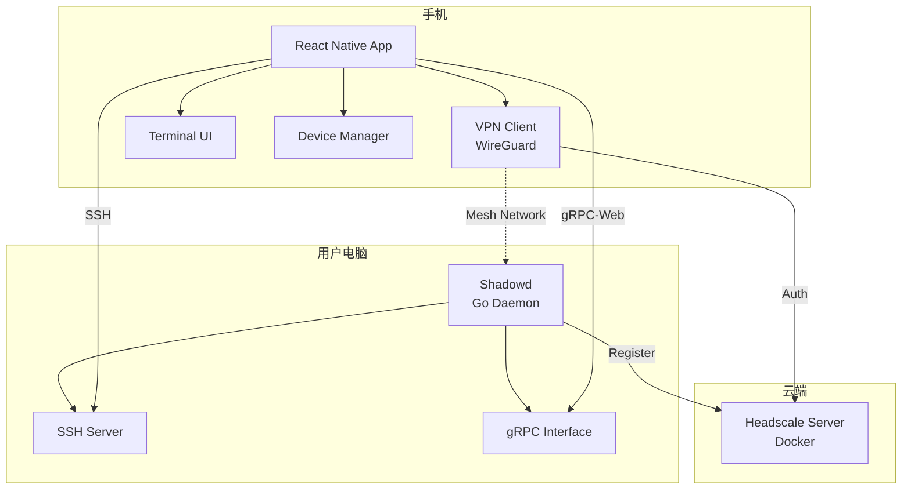
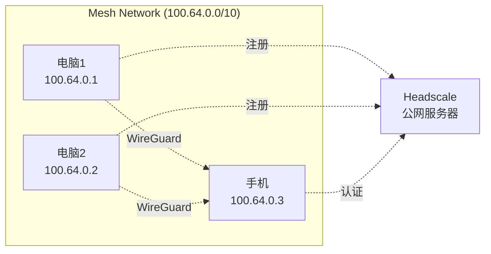

# 设计文档 - 影梭 (Shadow Shuttle)

## 概述

影梭是一个基于 Mesh 网络的跨平台远程 SSH 连接系统。系统采用三层架构：

1. **协调层**: Headscale 服务器管理设备注册和网络协调
2. **设备层**: Shadowd 守护进程运行在用户电脑上，提供 SSH 和 gRPC 接口
3. **客户端层**: React Native 移动应用提供 VPN 连接、设备发现和终端模拟功能

系统使用 WireGuard 协议建立端到端加密的 Mesh 网络，所有设备通过私有 IP 地址直接通信，无需公网 IP 或端口转发。

## 架构

### 系统架构图



### 网络拓扑



## 组件和接口

### M1: Headscale 协调服务器

**职责:**
- 管理设备注册和认证
- 分配 Mesh IP 地址
- 协调 WireGuard 密钥交换
- 提供 OIDC 身份认证

**部署方式:**
```yaml
# docker-compose.yml
version: '3.8'
services:
  headscale:
    image: headscale/headscale:latest
    container_name: headscale
    volumes:
      - ./config:/etc/headscale
      - ./data:/var/lib/headscale
    ports:
      - "8080:8080"
      - "9090:9090"
    restart: unless-stopped
```

**配置文件结构:**
```yaml
# config/config.yaml
server_url: https://your-domain.com
listen_addr: 0.0.0.0:8080
metrics_listen_addr: 0.0.0.0:9090
grpc_listen_addr: 0.0.0.0:50443

ip_prefixes:
  - 100.64.0.0/10

oidc:
  issuer: https://your-oidc-provider.com
  client_id: your-client-id
  client_secret: your-client-secret
```

**管理接口:**
- CLI: `headscale nodes list`, `headscale preauthkeys create`
- Web Console: OIDC 登录后的管理界面

### M2: Shadowd 守护进程

**职责:**
- 加入 Mesh 网络并保持连接
- 提供 SSH 访问接口
- 提供 gRPC-Web 接口用于设备信息查询
- 生成配对二维码

**核心接口:**

```go
// Device 设备信息
type Device struct {
    ID          string    `json:"id"`
    Name        string    `json:"name"`
    OS          string    `json:"os"`
    MeshIP      string    `json:"mesh_ip"`
    LastSeen    time.Time `json:"last_seen"`
}

// DeviceService gRPC 服务接口
service DeviceService {
    // 获取设备信息
    rpc GetDeviceInfo(Empty) returns (Device);
    
    // 生成配对二维码数据
    rpc GeneratePairingCode(Empty) returns (PairingCode);
    
    // 健康检查
    rpc HealthCheck(Empty) returns (HealthStatus);
}

// PairingCode 配对信息
type PairingCode struct {
    DeviceID   string `json:"device_id"`
    DeviceName string `json:"device_name"`
    MeshIP     string `json:"mesh_ip"`
    PublicKey  string `json:"public_key"`
    Timestamp  int64  `json:"timestamp"`
}
```

**启动流程:**
1. 读取配置文件（Headscale URL、预授权密钥）
2. 初始化 WireGuard 接口并连接到 Headscale
3. 启动 SSH 服务器（监听 Mesh IP）
4. 启动 gRPC-Web 服务器（监听 Mesh IP:50051）
5. 注册系统服务并保持运行

**配置文件:**
```yaml
# shadowd.yaml
headscale:
  url: https://your-domain.com
  preauth_key: your-preauth-key

ssh:
  port: 22
  host_key_path: /etc/shadowd/ssh_host_key

grpc:
  port: 50051
  tls_enabled: false

device:
  name: MyComputer
```

### M3: React Native App - 网络连接与设备发现

**职责:**
- 管理 VPN 连接状态
- 发现和管理设备列表
- 扫码配对新设备

**状态管理 (Zustand):**

```typescript
// stores/networkStore.ts
interface NetworkState {
  // VPN 状态
  vpnConnected: boolean;
  vpnConnecting: boolean;
  vpnError: string | null;
  
  // 设备列表
  devices: Device[];
  selectedDevice: Device | null;
  
  // 操作
  connectVPN: () => Promise<void>;
  disconnectVPN: () => Promise<void>;
  refreshDevices: () => Promise<void>;
  addDeviceByQR: (qrData: string) => Promise<void>;
  selectDevice: (device: Device) => void;
}

interface Device {
  id: string;
  name: string;
  os: string;
  meshIP: string;
  isOnline: boolean;
  lastSeen: Date;
}
```

**VPN 连接流程:**
1. 用户点击"连接 VPN"
2. 读取本地存储的 Headscale 配置
3. 调用原生模块建立 WireGuard 连接
4. 等待连接成功（最多 5 秒）
5. 更新 UI 状态为已连接

**设备发现流程:**
1. VPN 连接成功后自动触发
2. 遍历已保存的设备列表
3. 对每个设备发起 gRPC HealthCheck 请求
4. 根据响应更新设备在线状态
5. 每 30 秒自动刷新一次

**扫码配对流程:**
1. 用户点击"添加设备"并扫描二维码
2. 解析 QR 码中的 JSON 数据（PairingCode）
3. 验证时间戳（防止重放攻击）
4. 将设备信息保存到本地存储
5. 刷新设备列表

### M4: React Native App - 专家终端

**职责:**
- 建立和管理 SSH 连接
- 渲染终端界面
- 处理用户输入和命令输出

**SSH 连接管理:**

```typescript
// services/sshService.ts
interface SSHConnection {
  connect(host: string, port: number, privateKey: string): Promise<void>;
  disconnect(): Promise<void>;
  executeCommand(command: string): Promise<string>;
  startShell(): Promise<void>;
  write(data: string): Promise<void>;
  onData(callback: (data: string) => void): void;
  onClose(callback: () => void): void;
}

class SSHService implements SSHConnection {
  private client: SSHClient;
  private shell: SSHShell | null;
  
  async connect(host: string, port: number, privateKey: string): Promise<void> {
    this.client = new SSHClient();
    await this.client.connect({
      host,
      port,
      username: 'user',
      privateKey,
      timeout: 10000,
    });
  }
  
  async startShell(): Promise<void> {
    this.shell = await this.client.shell();
    this.shell.on('data', (data) => {
      this.dataCallback?.(data.toString());
    });
  }
  
  async write(data: string): Promise<void> {
    if (!this.shell) throw new Error('Shell not started');
    await this.shell.write(data);
  }
}
```

**终端 UI 组件:**

```typescript
// components/Terminal.tsx
interface TerminalProps {
  device: Device;
  onDisconnect: () => void;
}

const Terminal: React.FC<TerminalProps> = ({ device, onDisconnect }) => {
  const [output, setOutput] = useState<string>('');
  const [input, setInput] = useState<string>('');
  const sshService = useRef<SSHService>(new SSHService());
  
  useEffect(() => {
    // 建立 SSH 连接
    connectToDevice();
    
    return () => {
      // 清理连接
      sshService.current.disconnect();
    };
  }, [device]);
  
  const connectToDevice = async () => {
    try {
      const privateKey = await getPrivateKey();
      await sshService.current.connect(device.meshIP, 22, privateKey);
      await sshService.current.startShell();
      
      sshService.current.onData((data) => {
        setOutput(prev => prev + data);
      });
      
      sshService.current.onClose(() => {
        // 处理断线
        showReconnectDialog();
      });
    } catch (error) {
      showError(error);
    }
  };
  
  const handleSubmit = async () => {
    await sshService.current.write(input + '\n');
    setInput('');
  };
  
  return (
    <View style={styles.container}>
      <ScrollView style={styles.output}>
        <Text style={styles.outputText}>{output}</Text>
      </ScrollView>
      <TextInput
        style={styles.input}
        value={input}
        onChangeText={setInput}
        onSubmitEditing={handleSubmit}
        autoCapitalize="none"
        autoCorrect={false}
      />
    </View>
  );
};
```

## 数据模型

### 设备信息模型

```typescript
interface Device {
  // 唯一标识
  id: string;
  
  // 设备信息
  name: string;
  os: 'windows' | 'macos' | 'linux';
  osVersion: string;
  
  // 网络信息
  meshIP: string;
  publicKey: string;
  
  // 状态信息
  isOnline: boolean;
  lastSeen: Date;
  
  // 连接信息
  sshPort: number;
  grpcPort: number;
}
```

### VPN 配置模型

```typescript
interface VPNConfig {
  // Headscale 配置
  headscaleURL: string;
  preauthKey: string;
  
  // WireGuard 配置
  privateKey: string;
  publicKey: string;
  meshIP: string;
  
  // 连接状态
  isConnected: boolean;
  lastConnected: Date | null;
}
```

### SSH 会话模型

```typescript
interface SSHSession {
  // 会话标识
  id: string;
  deviceId: string;
  
  // 连接信息
  host: string;
  port: number;
  username: string;
  
  // 状态
  status: 'connecting' | 'connected' | 'disconnected' | 'error';
  connectedAt: Date | null;
  lastActivity: Date;
  
  // 终端状态
  terminalSize: { rows: number; cols: number };
  encoding: string;
}
```

## 正确性属性

*属性是一个特征或行为，应该在系统的所有有效执行中保持为真——本质上是关于系统应该做什么的形式化陈述。属性作为人类可读规范和机器可验证正确性保证之间的桥梁。*


### 属性 1: 设备 IP 唯一性
*对于任意* 多个设备注册请求，Headscale 服务器应该为每个设备分配唯一的 Mesh IP 地址，不存在 IP 冲突。
**验证需求: 1.3**

### 属性 2: 设备信息持久化往返
*对于任意* 设备，注册后重启 Headscale 服务器，该设备信息应该仍然存在且保持一致。
**验证需求: 1.4**

### 属性 3: SSH 连接可达性
*对于任意* 成功加入 Mesh 网络的设备，应该能够通过其 Mesh IP 地址建立 SSH 连接。
**验证需求: 2.2**

### 属性 4: gRPC 接口响应性
*对于任意* 有效的 gRPC 请求（包括 GetDeviceInfo、HealthCheck），Shadowd 应该返回符合协议的响应，且响应包含所有必需字段。
**验证需求: 2.3, 2.6**

### 属性 5: 网络断线自动重连
*对于任意* 网络断开事件，Shadowd 应该检测到断线并在网络恢复后自动重新连接到 Headscale。
**验证需求: 2.5**

### 属性 6: VPN 连接性能
*对于任意* VPN 连接请求，系统应该在 5 秒内完成 Mesh 网络连接建立。
**验证需求: 3.1, 7.1**

### 属性 7: VPN 断开清理
*对于任意* VPN 断开操作，系统应该立即断开连接并清理所有本地状态（包括路由表、连接缓存）。
**验证需求: 3.2**

### 属性 8: 设备发现和状态同步
*对于任意* 在线设备集合，Mobile App 连接到 Mesh 网络后应该显示所有在线设备，且设备状态变化时实时更新 UI。
**验证需求: 3.3, 3.5**

### 属性 9: 配对二维码往返
*对于任意* 有效的设备配对信息，生成二维码后扫描解析应该得到等价的设备信息（设备 ID、名称、Mesh IP、公钥）。
**验证需求: 3.4**

### 属性 10: VPN 连接错误处理
*对于任意* VPN 连接失败场景（网络不可达、认证失败、超时），Mobile App 应该显示具体的错误信息并提供重试选项。
**验证需求: 3.6**

### 属性 11: 设备信息持久化往返（移动端）
*对于任意* 已配对的设备，保存到本地存储后重启应用，设备信息应该仍然存在且保持一致。
**验证需求: 3.7**

### 属性 12: SSH 连接建立
*对于任意* 在线设备，用户选择连接后应该能够成功建立 SSH 会话。
**验证需求: 4.1**

### 属性 13: 命令执行完整性和性能
*对于任意* 在终端中输入的命令，系统应该在 100 毫秒内发送到远程电脑，并正确显示执行结果。
**验证需求: 4.3, 7.2**

### 属性 14: 命令输出显示性能
*对于任意* 远程电脑返回的命令输出，Mobile App 应该在 50 毫秒内显示在终端界面。
**验证需求: 7.3**

### 属性 15: SSH 断线检测和恢复
*对于任意* SSH 会话意外断开事件，Mobile App 应该检测到断线并提供重新连接选项。
**验证需求: 4.4**

### 属性 16: SSH 会话资源清理
*对于任意* 用户手动断开的 SSH 会话，系统应该清理所有连接资源（socket、缓冲区、监听器）并返回设备列表界面。
**验证需求: 4.5**

### 属性 17: ANSI 转义序列渲染
*对于任意* 包含 ANSI 转义序列的终端输出（颜色、粗体、斜体等），Mobile App 应该正确渲染这些格式。
**验证需求: 4.7**

### 属性 18: SSH 密钥认证强制
*对于任意* SSH 连接尝试，系统应该使用密钥认证，密码认证应该被禁用。
**验证需求: 5.2**

### 属性 19: Mesh 网络访问控制
*对于任意* 来自 Mesh 网络外部 IP 的连接请求，Shadowd 应该拒绝连接。
**验证需求: 5.3**

### 属性 20: 设备指纹验证
*对于任意* 首次连接的新设备，系统应该显示设备指纹并要求用户确认后才建立连接。
**验证需求: 5.5**

### 属性 21: 跨平台功能一致性
*对于任意* 操作系统（Windows、macOS、Linux），Shadowd 应该提供一致的 gRPC 接口和 SSH 功能，且正确处理平台特定的路径分隔符和换行符。
**验证需求: 6.3, 6.4**

### 属性 22: 统一错误处理和日志
*对于任意* 系统错误（网络错误、认证失败、资源不足），系统应该使用统一的错误处理机制记录日志，包含时间戳、错误类型和上下文信息。
**验证需求: 8.4**

## 错误处理

### 网络错误处理

**VPN 连接失败:**
- 错误类型: `VPN_CONNECTION_FAILED`
- 可能原因: 网络不可达、Headscale 服务器离线、认证失败
- 处理策略: 显示具体错误信息，提供重试按钮，记录错误日志

**SSH 连接失败:**
- 错误类型: `SSH_CONNECTION_FAILED`
- 可能原因: 设备离线、SSH 服务未启动、密钥认证失败
- 处理策略: 检查设备在线状态，提示用户检查 Shadowd 服务，提供重试选项

**网络断线:**
- 错误类型: `NETWORK_DISCONNECTED`
- 处理策略: 自动尝试重连（最多 3 次），显示重连进度，失败后提示用户手动重连

### 认证错误处理

**OIDC 认证失败:**
- 错误类型: `OIDC_AUTH_FAILED`
- 可能原因: 凭证过期、OIDC 提供商不可用
- 处理策略: 提示用户重新登录，清除本地凭证缓存

**SSH 密钥认证失败:**
- 错误类型: `SSH_KEY_AUTH_FAILED`
- 可能原因: 密钥不匹配、密钥文件损坏
- 处理策略: 提示用户重新生成密钥对，提供密钥管理界面

**设备指纹不匹配:**
- 错误类型: `DEVICE_FINGERPRINT_MISMATCH`
- 可能原因: 中间人攻击、设备重新安装
- 处理策略: 警告用户安全风险，要求明确确认后才继续连接

### 资源错误处理

**设备存储空间不足:**
- 错误类型: `STORAGE_FULL`
- 处理策略: 提示用户清理空间，暂停日志写入

**内存不足:**
- 错误类型: `OUT_OF_MEMORY`
- 处理策略: 关闭非活动 SSH 会话，清理缓存，记录错误日志

**并发连接超限:**
- 错误类型: `MAX_CONNECTIONS_REACHED`
- 处理策略: 提示用户关闭部分会话，显示当前活动会话列表

### 数据错误处理

**二维码解析失败:**
- 错误类型: `QR_CODE_PARSE_ERROR`
- 可能原因: 二维码损坏、格式不正确、时间戳过期
- 处理策略: 提示用户重新扫描，验证二维码格式和时间戳

**配置文件损坏:**
- 错误类型: `CONFIG_FILE_CORRUPTED`
- 处理策略: 使用默认配置，提示用户重新配置，备份损坏的配置文件

**设备信息不一致:**
- 错误类型: `DEVICE_INFO_MISMATCH`
- 处理策略: 刷新设备信息，如果持续不一致则提示用户重新配对

## 测试策略

### 双重测试方法

系统采用单元测试和基于属性的测试相结合的方法：

**单元测试:**
- 验证特定示例和边缘情况
- 测试组件之间的集成点
- 测试错误条件和异常处理
- 验证跨平台兼容性

**基于属性的测试:**
- 验证适用于所有输入的通用属性
- 通过随机化实现全面的输入覆盖
- 每个属性测试最少运行 100 次迭代
- 每个测试必须引用设计文档中的属性

### 测试配置

**Go (Shadowd):**
- 单元测试框架: `testing` 包
- 基于属性的测试库: `gopter`
- 最小迭代次数: 100
- 标签格式: `// Feature: shadow-shuttle, Property {number}: {property_text}`

**TypeScript (Mobile App):**
- 单元测试框架: `Jest`
- 基于属性的测试库: `fast-check`
- 最小迭代次数: 100
- 标签格式: `// Feature: shadow-shuttle, Property {number}: {property_text}`

### 测试覆盖范围

**M1: Headscale 服务器**
- 单元测试: Docker 部署验证、CLI 命令测试、OIDC 登录流程
- 属性测试: 属性 1（IP 唯一性）、属性 2（持久化往返）

**M2: Shadowd 守护进程**
- 单元测试: 服务启动、跨平台兼容性、系统服务注册
- 属性测试: 属性 3（SSH 可达性）、属性 4（gRPC 响应）、属性 5（自动重连）、属性 19（访问控制）、属性 21（跨平台一致性）

**M3: 网络连接与设备发现**
- 单元测试: VPN 连接流程、设备列表 UI、二维码扫描
- 属性测试: 属性 6（连接性能）、属性 7（断开清理）、属性 8（设备发现）、属性 9（二维码往返）、属性 10（错误处理）、属性 11（持久化往返）

**M4: 专家终端**
- 单元测试: 终端 UI 组件、SSH 客户端初始化、基本终端功能
- 属性测试: 属性 12（SSH 连接）、属性 13（命令执行）、属性 14（输出性能）、属性 15（断线检测）、属性 16（资源清理）、属性 17（ANSI 渲染）、属性 18（密钥认证）、属性 20（指纹验证）

**跨模块集成测试**
- 端到端流程: 设备注册 → VPN 连接 → 设备发现 → SSH 连接 → 命令执行
- 性能测试: 并发会话测试（10+ 会话）
- 安全测试: 外部访问拒绝、密钥认证强制、指纹验证

### 测试环境

**开发环境:**
- 本地 Headscale 服务器（Docker）
- 模拟的多设备环境
- 网络模拟工具（延迟、丢包、断线）

**CI/CD 环境:**
- 自动化测试在每次提交时运行
- 跨平台测试矩阵（Windows、macOS、Linux、iOS、Android）
- 性能基准测试和回归检测

**测试数据生成:**
- 使用属性测试库生成随机设备信息
- 生成各种网络条件（延迟、带宽限制）
- 生成各种 SSH 命令和输出场景
